# El lenguaje de la investidura: análisis lingüístico-computacional de los discursos presidenciales españoles (1979-2023)

### Informe de resultados y discusión

**Albert Millán** — [LinkedIn](https://www.linkedin.com/in/albert-millan-iniesta/) · [Portafolio](https://albertmillan.wordpress.com/)

*Nota de lectura: este informe está pensado para dos tipos de lector. Cada
apartado empieza con un recuadro **"En palabras sencillas"** — léelo si no
tienes formación técnica y quieres entender qué se hizo y qué se encontró.
El texto que sigue después entra en el detalle metodológico y estadístico,
pensado para un lector con background técnico. Puedes leer solo los
recuadros de principio a fin y tener una comprensión completa del proyecto.*

---

## Resumen

> **En palabras sencillas**: cogimos los 15 discursos con los que cada presidente de la democracia española actual se ha presentado ante el Congreso para pedir la confianza de los diputados y diputadas (desde Adolfo Suárez en 1979 hasta Pedro Sánchez en 2023), y usamos herramientas de análisis de texto para medir cosas que a simple vista son difíciles de comparar: ¿se ha vuelto más fácil de entender el discurso político? ¿Suena más positivo o más negativo con el paso del tiempo? ¿De qué habla cada presidente que no hablen los demás? Estas mismas herramientas, aplicadas a otro tipo de texto, son las que usan a diario periodistas y politólogos para estudiar cómo cambia la comunicación política, o las empresas para saber si sus clientes están contentos sin leer miles de opiniones una a una. Encontramos cuatro patrones claros y bien respaldados por los datos.

Este informe analiza los 15 discursos de investidura pronunciados por los presidentes del Gobierno de España entre 1979 y 2023, combinando métricas de legibilidad, riqueza léxica, similitud textual, análisis de sentimiento (con dos léxicos independientes) y modelado de temas. Los resultados apuntan a cuatro grandes patrones:

1. Una **simplificación progresiva y sostenida del estilo** — frases más cortas, léxico más accesible.
2. Un **declive del tono positivo del discurso**, especialmente marcado desde 2011, confirmado no por una sino por **dos métricas de sentimiento construidas de forma totalmente independiente**, que coinciden entre sí con una correlación fuerte y estadísticamente significativa (ρ = 0,78; p = 0,001).
3. Una **reconfiguración del espacio político-discursivo desde 2015**, que el análisis de similitud textual detecta como un bloque diferenciado del resto de la serie histórica.
4. **Cuatro maneras distintas de ocupar el espacio discursivo** según la etapa — gestión de política económica nacional, integración institucional europea, ampliación de derechos sociales, y confrontación ideológica directa — más ricas que la simple dicotomía "izquierda social / derecha económica".

El modelado de temas, aunque produce categorías interpretables, muestra una fiabilidad desigual: algunos de sus tópicos son robustos y se mantienen estables aunque cambiemos los parámetros del modelo; otros probablemente no lo son. Este informe distingue explícitamente cuáles son cuáles, en vez de presentar los cinco por igual.

---

## 1. Introducción y objetivos

> **En palabras sencillas**: un discurso de investidura es el primer discurso que da un candidato a presidente del Gobierno ante el Congreso de los Diputados, para explicar su programa y pedir que le den su confianza (le voten a favor). Es un texto largo, escrito con cuidado y pensado para convencer — por eso es un buen material para este tipo de análisis. Y este tipo de análisis no es solo un ejercicio académico curioso: las mismas herramientas que usamos aquí se emplean a diario fuera de la política — periodistas y politólogos las usan para detectar, con datos y no solo con impresión, si el discurso de un partido se ha vuelto más agresivo o más conciliador con el tiempo; empresas las usan (con las mismas técnicas, aplicadas a opiniones de clientes) para saber si la gente está contenta sin leer miles de reseñas una a una. En el fondo, lo que hacemos aquí es lo mismo que haría un politólogo con mucha paciencia y una regla de medir muy precisa: convertir una impresión subjetiva ("este discurso suena más negativo") en un número que se puede comparar, contrastar y defender con datos.

El discurso de investidura combina la rendición de cuentas programática con la persuasión parlamentaria necesaria para obtener la confianza de la Cámara (artículo 99 de la Constitución). A diferencia de otros géneros políticos (mítines, ruedas de prensa), es un texto largo, escrito, revisado y con vocación de quedar registrado — lo que lo convierte en una fuente especialmente adecuada para el análisis cuantitativo de texto.

Este proyecto se planteó con un objetivo exploratorio: usar el corpus completo de discursos de investidura de la democracia española actual para poner en práctica un abanico amplio de técnicas de análisis de texto en R, sin restringirnos a una única hipótesis cerrada. El resultado combina evidencia cuantitativa (estilo, tono, similitud) con lectura cualitativa (palabras clave, contexto, temas), señalando explícitamente qué hallazgos son sólidos y cuáles deben tomarse como hipótesis a contrastar con un corpus mayor.

---

## 2. Corpus y metodología

### 2.1 El corpus

> **En palabras sencillas**: tenemos 15 discursos, uno o varios por cada uno de los 7 presidentes que ha tenido España en democracia. No están repartidos a partes iguales — Felipe González dio 4, Pedro Sánchez 2, y algunos presidentes solo 1 — así que hay que tener cuidado al comparar "por presidente" o "por partido", porque no es una comparación entre grupos del mismo tamaño.

15 discursos de investidura, desde Adolfo Suárez (1979) hasta Pedro Sánchez (2023), cubriendo los tres partidos que han gobernado España (UCD, PSOE, PP) y siete presidentes. El corpus no está equilibrado por presidente (González y Sánchez tienen 4 y 2 discursos respectivamente, frente a un único discurso de Suárez, Calvo-Sotelo o Aznar en algún año) ni por partido (8 discursos PSOE, 5 PP, 2 UCD) — una asimetría que condiciona la interpretación de cualquier comparación agregada (apartado 4).

### 2.2 Pipeline de procesamiento y por qué se eligió cada método

> **En palabras sencillas**: antes de poder "contar palabras" de forma útil, hay que limpiar y preparar el texto — reducir cada palabra a su forma base, quitar palabras muy comunes que no aportan información, y elegir con qué regla se mide cada cosa (legibilidad, variedad de vocabulario, parecido entre textos...). Ninguna de estas reglas es la única posible, así que aquí explicamos por qué elegimos cada una.

1. **Carga y limpieza**: corpus `quanteda` a partir de los `.txt`, con metadatos de año, presidente y partido.

2. **Lematización morfosintáctica con `UDPipe`**: se eligió específicamente porque, a diferencia de un simple recorte de sufijos (*stemming*), UDPipe etiqueta también la categoría gramatical de cada palabra (sustantivo, verbo, adjetivo...) — sin ese etiquetado no habría sido posible filtrar el corpus para quedarnos solo con sustantivos, nombres propios y adjetivos, que es la base de casi todo el análisis de contenido posterior.

3. **Exclusión deliberada de los verbos**: no es que los verbos carezcan de contenido — al contrario, transmiten mucho (un presidente que usa "pactar" y "dialogar" dice algo muy distinto de uno que usa "exigir" e "imponer"). El motivo de excluirlos es puramente práctico: los verbos conjugados generan mucha variación morfológica que, tras lematizar, colapsa en un puñado de verbos muy genéricos y frecuentes en cualquier discurso político ("ser", "tener", "poder", "hacer"), aportando poco valor distintivo al *keyness* o a las nubes de palabras. Se decidió que esa pérdida de información merecía la pena a cambio de un análisis de contenido más limpio — con la salvedad de que cualquier pregunta sobre el *tono de la acción política* (colaborativo o impositivo) queda fuera del alcance de este informe y se propone como línea de trabajo futura (apartado 7).

4. **Legibilidad con el índice Fernández-Huerta**: `quanteda` no incluye fórmulas de legibilidad calibradas para español — Flesch-Kincaid y FOG están pensadas para la distribución de sílabas y longitud de palabra del inglés. Fernández-Huerta es la adaptación clásica de Flesch para español, y por eso se calculó manualmente.

5. **Riqueza léxica con MATTR en ventanas de 100 palabras**: se descartó el TTR clásico (proporción simple de palabras distintas) porque decae de forma mecánica cuanto más largo es el texto — y los 15 discursos varían mucho en longitud (de 5.862 a 15.243 palabras). MATTR calcula esa proporción en ventanas móviles de tamaño fijo (aquí, 100 palabras) y promedia el resultado, lo que lo hace comparable entre discursos de longitud muy distinta.

6. **Similitud con TF-IDF, no con frecuencias sin ponderar**: la primera versión de este análisis probó ambos enfoques. Se decidió usar TF-IDF (que resta peso a las palabras muy comunes en todos los discursos y da más peso a las distintivas) para unificar el criterio entre el mapa de calor de similitud y el dendrograma de agrupación jerárquica — así ambos gráficos cuentan la misma historia con la misma métrica de fondo, en vez de mezclar dos nociones distintas de "parecido".

7. **Contenido**: frecuencias, nubes de palabras, *keyness* y KWIC (concordancias) sobre seis ejes temáticos.

8. **Modelado de temas**: *Structural Topic Model* (STM) con dos especificaciones — K=5 con covariables de partido/año, y K=3 sin covariables como prueba de robustez.

9. **Sentimiento**: dos léxicos independientes — NRC traducido automáticamente (vía `syuzhet`) y **ML-Senticon**, un léxico de polaridad revisado por hablantes nativos de español (Cruz, Troyano, Pontes y Ortega, 2014; Universidad de Sevilla), incorporado específicamente para poder contrastar el resultado del léxico traducido con uno nativo.

10. **Listas de *stopwords***: además de la lista estándar en español, se fue ampliando en varias rondas a medida que se detectaban fórmulas de cortesía parlamentaria ("señoría"/"señorías", "señora presidenta"), muletillas propiamente dichas ("por consiguiente", tic verbal de González) y expresiones genéricas sin valor distintivo ("punto de vista": tiene significado real, pero es tan transversal a cualquier discurso formal que no aporta nada específico al análisis) que se colaban en los resultados. El detalle de cada corrección concreta se documenta en el apartado 3.2, donde se detectaron.

### 2.3 Limitaciones metodológicas (léase antes de interpretar los resultados)

> **En palabras sencillas**: ninguna herramienta de análisis de texto es perfecta ni neutral — cada una implica una decisión con consecuencias. Aquí dejamos por escrito, sin adornos, dónde están los puntos débiles de este análisis, para que nadie (empezando por nosotros) se lleve una impresión más segura de la cuenta.

- **Tamaño del corpus (n=15)**: la limitación transversal más importante. Suficiente para estadística descriptiva, insuficiente para que el STM (K=5 con covariables) sea plenamente fiable — se retoma en el apartado 3.6. También limita la potencia de cualquier prueba de significancia estadística: con tan pocos casos, un resultado no significativo no demuestra ausencia de relación, solo que puede haber pocos datos para detectarla con confianza. (Esto no afecta a la correlación entre los dos léxicos de sentimiento del apartado 3.7 — ese resultado sí es significativo — pero conviene tenerlo presente como principio general al leer cualquier prueba estadística de este informe.)
- **Exclusión de verbos**: ver la justificación completa en el apartado 2.2.
- **Léxico NRC traducido automáticamente**: no es un léxico nativo validado — por eso se complementa con ML-Senticon (apartado 3.7.3).
- **Un caso puntual de etiquetado gramatical incorrecto**: "insisto" (un verbo que Rajoy inserta como inciso parentético — "España, insisto, tiene mucho que aportar") sobrevivió al filtro de categoría gramatical en el *keyness*. Sigue siendo gramaticalmente un verbo, no cambia de categoría — pero esa posición atípica, aislada entre comas y sin sujeto ni objeto cercanos, parece confundir al etiquetador estadístico de UDPipe. Es un caso aislado, no sistemático.
- **Confusión entre partido y época**: el diseño del corpus (partidos que gobiernan en periodos históricos no solapados) hace que cualquier diferencia "por partido" pueda en realidad deberse a la época, no al partido — se ilustra con un caso concreto en el apartado 4.
- Los índices de legibilidad y riqueza léxica son **aproximaciones**, no medidas exactas.

---

## 3. Resultados y discusión

### 3.1 Estilo y forma del discurso

> **En palabras sencillas**: medimos si el discurso político se ha vuelto más fácil o más difícil de leer, y si las frases se han hecho más largas o más cortas. Resultado: se ha vuelto claramente más fácil de leer, sobre todo porque las frases son bastante más cortas que hace 40 años.

| Año | Presidente | Partido | Palabras | Fernández-Huerta | MATTR (lemas) |
|---|---|---|---|---|---|
| 1979 | Suárez | UCD | 12.111 | 38,65 | 0,84 |
| 1981 | Calvo-Sotelo | UCD | 8.442 | 48,15 | 0,81 |
| 1982 | González | PSOE | 9.398 | 41,67 | 0,85 |
| 1986 | González | PSOE | 11.335 | 39,22 | **0,72** |
| 1989 | González | PSOE | 7.588 | 42,40 | 0,79 |
| 1993 | González | PSOE | 8.117 | 39,08 | 0,81 |
| 1996 | Aznar | PP | 10.162 | 43,67 | 0,83 |
| 2000 | Aznar | PP | 8.321 | 51,19 | 0,81 |
| 2004 | Zapatero | PSOE | 7.868 | 46,62 | 0,82 |
| 2008 | Zapatero | PSOE | 9.477 | 48,39 | 0,81 |
| 2011 | Rajoy | PP | 9.678 | 53,88 | 0,81 |
| 2015 | Rajoy | PP | 9.974 | 50,41 | 0,82 |
| 2016 | Rajoy | PP | 5.862 | 54,86 | 0,84 |
| 2020 | Sánchez | PSOE | 15.243 | 52,54 | 0,81 |
| 2023 | Sánchez | PSOE | 14.062 | 55,68 | 0,82 |

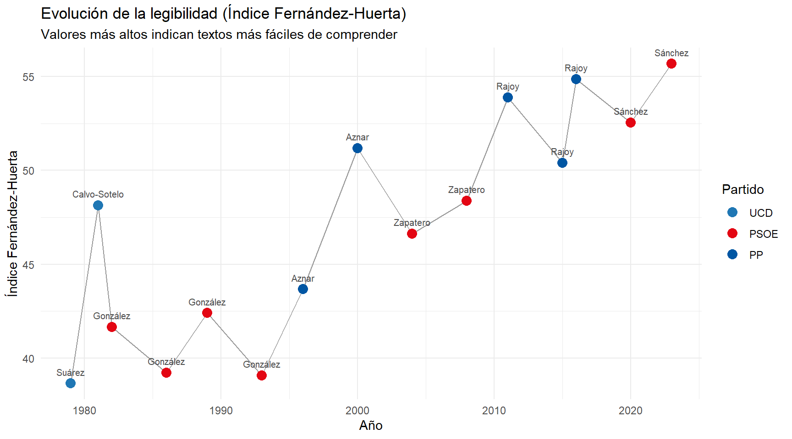

**Legibilidad ascendente y estructuralmente explicada.** El índice Fernández-Huerta sube de forma prácticamente monótona: de 38,65 (Suárez, 1979) a 55,68 (Sánchez, 2023) — casi 17 puntos. Como la longitud media de frase es uno de los dos componentes de la propia fórmula, una parte del ascenso no es un hallazgo independiente sino una consecuencia casi mecánica de frases más cortas.

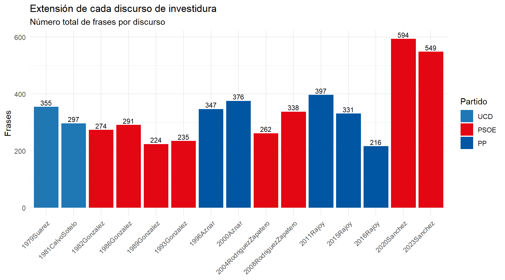

**El caso Sánchez es el más llamativo de la tabla.** Sus dos discursos (2020, 2023) tienen el mayor número de palabras del corpus, pero también el mayor número de frases (casi el doble que la media). Es "decir mucho, pero en trozos pequeños y fáciles de seguir" — un estilo bien diferenciado del resto.

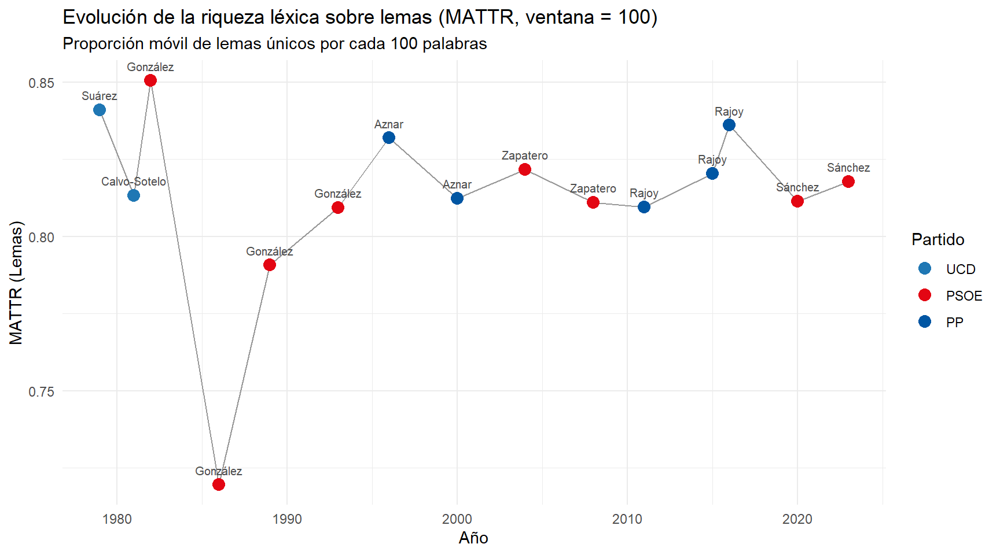

El MATTR es plano (~0,79-0,85) con una única excepción: **González 1986 (0,72)**, un valle claramente anómalo que sugiere una repetición léxica real dentro de ese discurso concreto, no un artefacto de la longitud del texto (el MATTR ya corrige por eso).

### 3.2 Contenido léxico: palabras y *keyness*

> **En palabras sencillas — *keyness***: es una prueba estadística que responde a la pregunta "¿qué palabras usa este presidente muchísimo más que el resto?". No busca las palabras más repetidas sin más (esas suelen ser genéricas, tipo "país" o "gobierno"), sino las que de verdad lo distinguen frente a los demás.

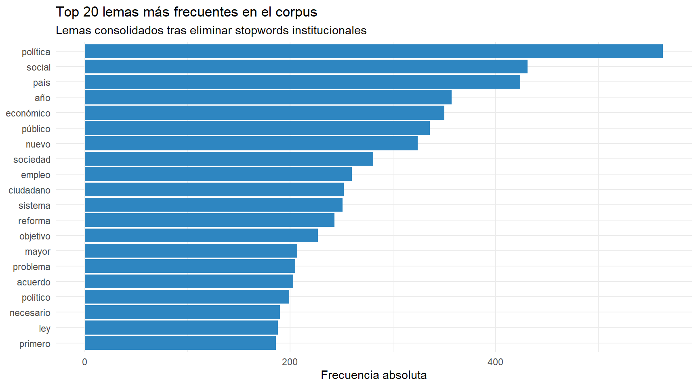

**Nota de calidad de datos**: la lista de *stopwords* (palabras excluidas por no aportar contenido) se amplió en varias rondas al detectar, revisando estos mismos resultados, fórmulas de cortesía que se colaban sin filtrar: "señoría"/"español" en una primera revisión; "señora"/"presidenta" (la fórmula "Señora presidenta" aparece 11 veces solo en Aznar 2000, dirigida a la presidenta del Congreso de la época) y "vista"/"punto" (la expresión "punto de vista" — tiene significado propio, pero es tan genérica y transversal a cualquier discurso formal que no aporta ningún valor distintivo) en una segunda. Las seis correcciones están aplicadas y verificadas: ninguna aparece ya en el top-20 ni en el *keyness*.

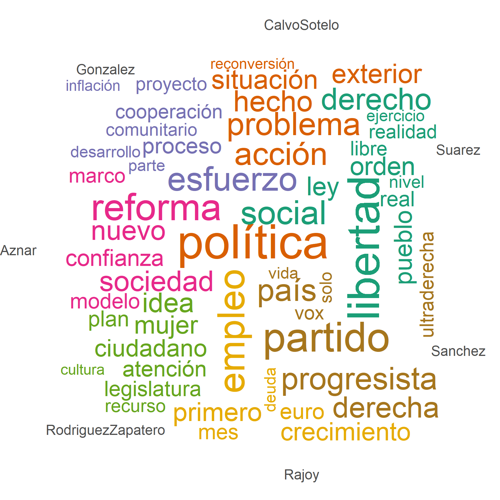

El *keyness* se calcula **por discurso individual** (15 discursos), no por presidente agregado (7 grupos) — agregar, por ejemplo, los dos discursos de Aznar en un solo bloque escondería por diseño cualquier diferencia entre su primer mandato (1996, necesitando el apoyo parlamentario de PNV y CiU) y el segundo (2000, con mayoría absoluta), que es precisamente el tipo de contraste más interesante de observar. Por la cantidad de paneles, se muestra en dos gráficos por época:

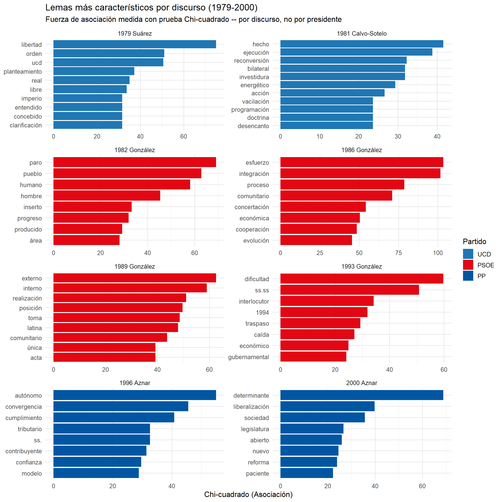

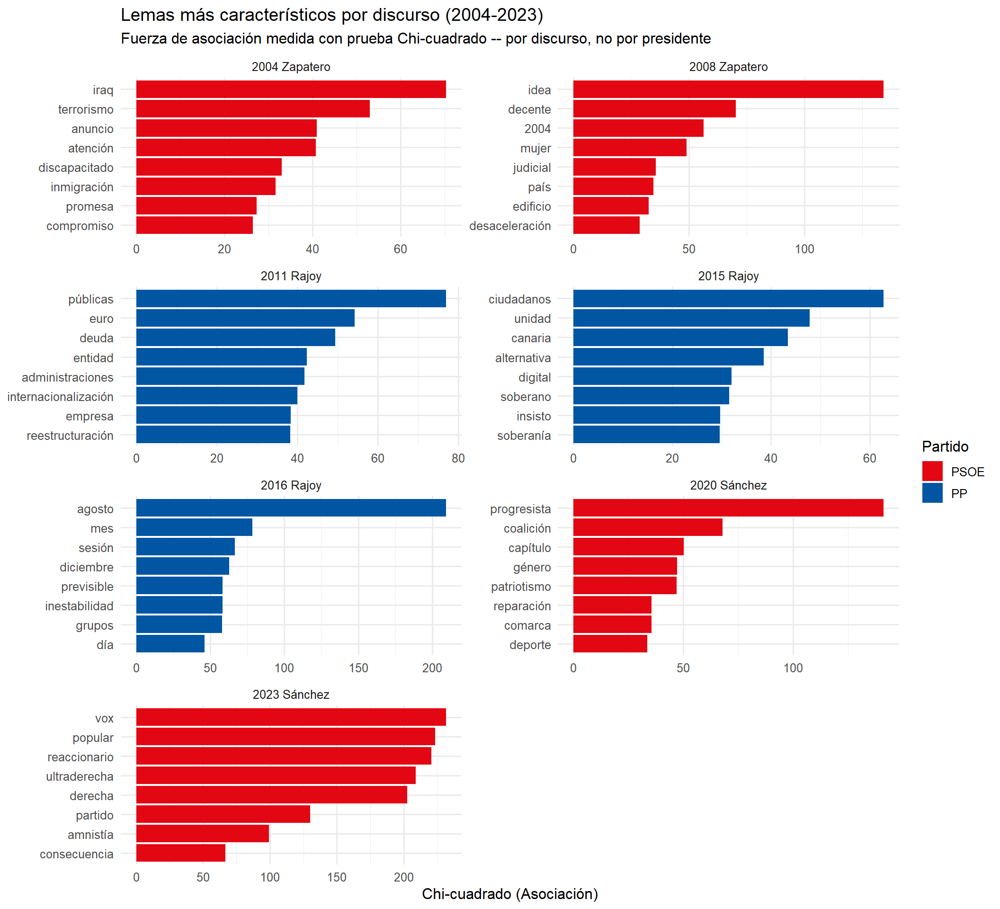

**Algunos contrastes destacables:**

- **Aznar 1996** (*autónomo, convergencia, cumplimiento, tributario, contribuyente, confianza*) frente a **Aznar 2000** (*determinante, liberalización, sociedad, legislatura, reforma*): en 1996 domina el vocabulario de cooperación fiscal y **convergencia** — el término técnico de los criterios de Maastricht para la adopción del euro, muy oportuno en un año en que España negociaba su entrada en la moneda única necesitando apoyos parlamentarios. En 2000, el vocabulario de **liberalización** y reforma suena más unilateral, coherente con no necesitar ya negociar el programa con nadie. Es un contraste real de *qué* política propone cada vez — pero, como se ve en el apartado 3.7.1, no de *tono*: el sentimiento neto (0,40 y 0,41) y la proporción de "ira" (0,074 y 0,072) son prácticamente idénticos entre ambos discursos. Si existe la asertividad mayor que cabría esperar de un Gobierno con mayoría absoluta, probablemente vive más en los verbos (excluidos de este análisis, apartado 2.2) que en el vocabulario nominal que aquí se mide.
- **González 1986** (*esfuerzo, integración, comunitario, concertación*) frente a **González 1993** (*dificultad, interlocutor, caída, gubernamental*): el giro de la retórica optimista de la adhesión europea al lenguaje de gestión de la crisis del Sistema Monetario Europeo es otro ejemplo de cómo la vista por discurso individual capta una evolución real que la vista agregada por presidente no podría mostrar.
- **Sánchez 2023** (*vox, popular, reaccionario, ultraderecha, derecha, partido, amnistía, consecuencia*): es, con diferencia, el discurso cuyo vocabulario característico nombra más directamente a un adversario político — y de hecho a **dos**: "popular" y "partido" no son adjetivos genéricos en este contexto, sino que corresponden casi en su totalidad a menciones explícitas del **Partido Popular**, frecuentemente emparejado con Vox en el propio discurso ("el Partido Popular y Vox", "el Partido Popular con Vox"). El hallazgo, por tanto, no es que Sánchez nombre solo a Vox — nombra explícitamente a sus dos principales adversarios parlamentarios, presentados además como aliados entre sí.

### 3.3 Perfil temático por discurso (diccionario simple)

> **En palabras sencillas**: además del *keyness* (que busca qué es distintivo), contamos directamente cuántas palabras de cada discurso caen en categorías temáticas que **definimos nosotros mismos de antemano** (economía, política social, integración europea). Es importante tener esto presente: el gráfico no representa "de qué habló cada presidente" en general — solo reparte, entre estas tres categorías, la pequeña fracción de palabras de cada discurso que coincide con alguna de las tres listas que construimos. Un presidente puede hablar mucho de un tema que no esté en ninguna de las tres listas (Suárez, por ejemplo, habla mucho de "libertad" y "Constitución" — su *keyness* principal — y eso no cuenta para nada en este gráfico, porque ninguna de las dos palabras está en las listas).

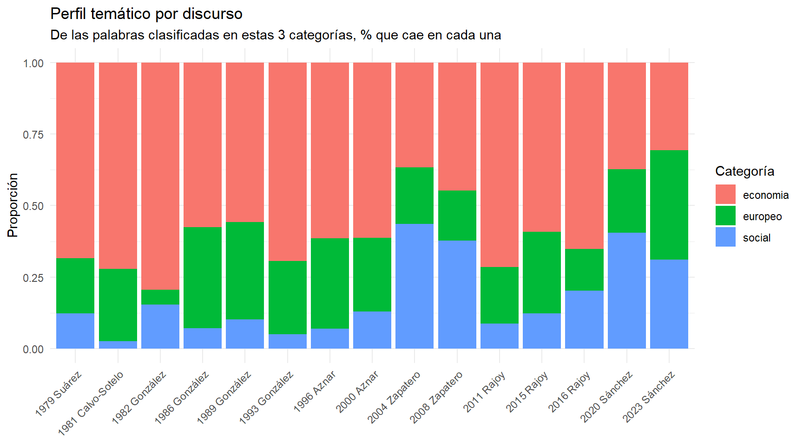

Con esa salvedad presente, el patrón confirma, con esta segunda técnica independiente, buena parte de lo que ya sugería el *keyness*: Zapatero (2004 y 2008) y Sánchez (2020) destacan con la mayor proporción de vocabulario social del corpus (dentro de lo que las listas capturan); la proporción de vocabulario "europeo" es más alta en la etapa fundacional y en González; y la economía domina el vocabulario de la mayoría de discursos en términos absolutos, con independencia de partido.

#### 3.3.1 Un intento descartado, y por qué (documentado a propósito)

*Esta subsección no presenta un resultado — documenta un experimento real que no llegó a resultado fiable, porque nos parece más honesto explicarlo que borrarlo sin dejar rastro.*

La primera versión de este diccionario incluía una cuarta categoría, "adversarial", pensada para medir lenguaje de confrontación política. Se descartó por dos problemas:

1. Una primera versión incluía nombres propios de la actualidad más reciente ("vox", "abascal") — palabras que por definición solo pueden aparecer desde 2020, así que cualquier resultado que las incluyera estaba determinado de antemano por el diseño de la lista, no por lo que decía cada presidente.
2. Incluso retirando esos nombres propios, el recuento seguía siendo **engañoso** por un motivo más estructural: un diccionario de palabras sueltas no distingue negaciones. Al comprobar con el texto real qué frases generaban el recuento más alto (2020 Sánchez, por encima incluso de 2023), se encontró que Sánchez **no estaba siendo hostil — estaba rechazando la hostilidad explícitamente**: *"No tenemos enemigos personales en esta Cámara, créanme"*; *"no traslademos desde esta tribuna más división a la calle"*. El diccionario contaba la palabra "enemigo", pero no distinguía "somos enemigos" de "no tenemos enemigos". Mientras tanto, en 2023 sí aparecían usos genuinamente adversariales sin negación (*"alzamos un muro ante estos ataques recurrentes"*; *"los reaccionarios cuyo único propósito es... la confrontación"*), pero con un recuento total menor — el número bruto salía, literalmente, al revés de lo que sugiere una lectura cuidadosa del texto.

**La categoría se retiró del análisis cuantificado por este motivo**, y el propio documento de análisis incluye ahora un fragmento de código que reproduce estos ejemplos directamente sobre el texto de origen, para que la afirmación sea verificable, no solo una cita pegada en el informe. No es un fallo de esta lista de palabras en particular — es un límite estructural de cualquier diccionario de palabras sueltas (*bag-of-words*): no ve negaciones, ni citas indirectas, ni a quién se dirige una palabra. Corregirlo de verdad exigiría detectar el alcance de la negación en la estructura gramatical de la frase, algo que UDPipe registra (la relación de dependencia sintáctica) pero que este análisis no aprovecha. Queda como línea de trabajo futura (apartado 7). El hallazgo real y verificado sobre la confrontación directa de Sánchez sigue documentado — pero en el *keyness* del apartado 3.2, que sí detecta distintividad léxica sin necesitar entender negaciones.

### 3.4 Contexto de palabras clave: seis ejes históricos

> **En palabras sencillas**: buscamos palabras concretas ("terrorismo", "crisis", "Cataluña"...) y vemos en qué momento de cada discurso aparecen y con qué frecuencia — como un buscador dentro de cada texto, pero visualizado. Sirve para confirmar si la aparición de un tema coincide con el momento histórico en que cabría esperarlo.

Los gráficos completos de los seis ejes (terrorismo/paz, integración europea, economía/crisis, territorial, igualdad, gobernabilidad) están en el documento HTML del análisis; aquí resumimos los patrones:

- **Terrorismo y paz**: presencia constante hasta 2008, con caída visible después — coherente con la disolución de ETA en 2018.
- **Integración europea**: presente en los 15 discursos sin excepción — el único eje verdaderamente constante en toda la serie.
- **Economía y crisis**: repunta con claridad en 1993 (crisis del SME) y 2011-2015 (crisis financiera) — justo donde la historia económica española lo anticiparía.
- **Cuestión territorial**: "autonomías" es más denso en la etapa fundacional; "Cataluña" apenas aparece antes de 2008 y se dispara en Sánchez 2020/2023.
- **Igualdad**: tendencia ascendente clara, de menciones puntuales a densidad notable en Sánchez.
- **Gobernabilidad y pactos**: se intensifica en gobiernos de coalición o minoría (Sánchez 2020, Rajoy 2016) frente a los de mayoría absoluta.

### 3.5 Similitud entre discursos

> **En palabras sencillas**: medimos qué tan parecido es el vocabulario de cada discurso al de los demás, y agrupamos los que más se parecen entre sí — como hacer "familias" de discursos según de qué hablan, sin decirle al programa de antemano qué grupos buscar.

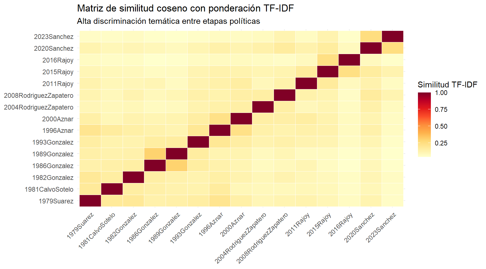

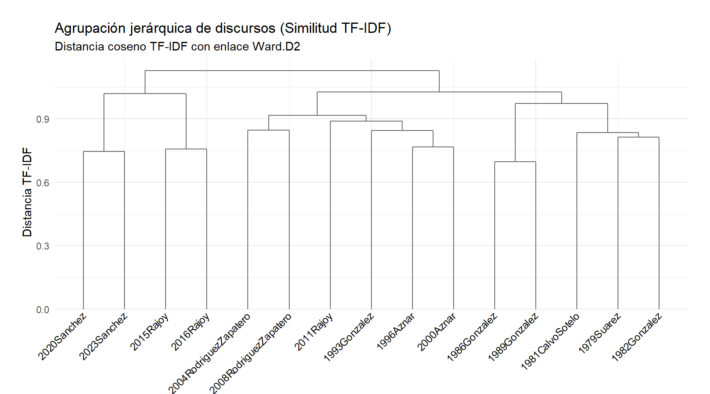

> **En palabras sencillas — cómo leer el dendrograma**: cada línea vertical es un discurso; cuanto más abajo se juntan dos líneas, más parecidos son entre sí. Cuanto más arriba se separan dos grupos grandes, más distintos son.

**Sánchez 2020+2023 y Rajoy 2015+2016 se agrupan primero entre sí, y ese grupo combinado se separa del resto del corpus en el nivel más alto de la jerarquía** — la división estructural más importante no es entre partidos, sino entre **2015-2023 y todo lo anterior**. Coherente con la fragmentación del sistema de partidos español desde 2015: los discursos de esta etapa comparten un vocabulario de negociación multipartidista que los distingue léxicamente de toda la etapa bipartidista anterior, con independencia del partido gobernante.

### 3.6 Modelado de temas (STM): qué es fiable y qué no

> **En palabras sencillas**: le pedimos al programa que agrupe automáticamente las palabras del corpus en un número fijo de "temas" (sin decirle nosotros cuáles son) y que nos diga qué palabras definen cada tema. Es una herramienta potente, pero necesita muchos documentos para funcionar bien de verdad — y aquí tenemos solo 15. Por eso repetimos el ejercicio con dos configuraciones distintas (5 temas y 3 temas) para ver cuáles de esos temas son "de fiar" y cuáles podrían ser ruido.

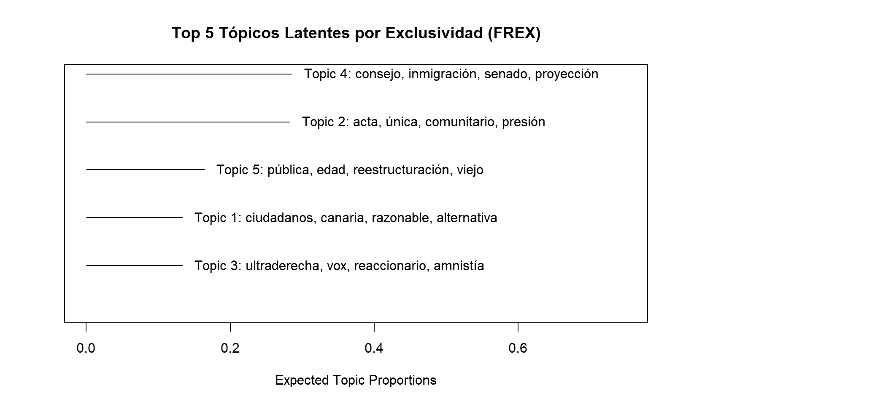

**Modelo principal (K=5, con covariables de partido y año):**

| Tópico | Palabras FREX más distintivas | Periodo/discurso que representa |
|---|---|---|
| 1 | ciudadanos, canaria, razonable, alternativa, soberano, soberanía, fiable, sesión | Rajoy 2011-2016 |
| 2 | acta, única, comunitario, presión, juicio, interno, respecto, tema, alianza, 1992 | González 1986-1989 (integración europea) |
| 3 | ultraderecha, vox, reaccionario, amnistía, derecha, progresista, lgtbi, odio | Sánchez 2023 |
| 4 | consejo, inmigración, senado, proyección, telecomunicación, convergencia, autonomías | Zapatero 2004 |
| 5 | pública, edad, reestructuración, viejo, independencia, ucd, entidad, estatal | Suárez/Calvo-Sotelo (Transición) |

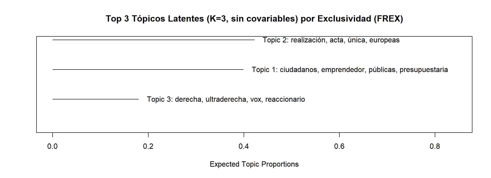

**Modelo de robustez (K=3, sin covariables):**

| Tópico | Palabras FREX | Coincide con (K=5) |
|---|---|---|
| 1 | ciudadanos, emprendedor, públicas, presupuestaria, canaria, telecomunicación | Tópico 1 (Rajoy, crisis) |
| 2 | realización, acta, única, europeas, interno, 1992 | Tópico 2 (González, UE) |
| 3 | derecha, ultraderecha, vox, reaccionario, amnistía, progresista | Tópico 3 (Sánchez 2023) |

Los tres tópicos del modelo K=3 coinciden, casi palabra por palabra, con tres de los cinco tópicos del modelo K=5 (crisis/Rajoy, integración europea/González, y polarización/Sánchez 2023). **Estos tres son razonablemente robustos** — aparecen con independencia de cómo configuremos el modelo. En cambio, los Tópicos 4 (Zapatero) y 5 (Transición) del modelo K=5 **no tienen equivalente claro en el modelo K=3** — se diluyen o se reparten entre los otros tres al reducir el número de temas, lo cual es consistente con que sean más sensibles al sobreajuste del que advertíamos.

**Aviso metodológico**: con 15 documentos y una fórmula de prevalencia de 5-6 parámetros en el modelo K=5, sigue habiendo margen considerable para que el modelo se ajuste a particularidades de documentos concretos en vez de a temas genuinamente compartidos. La comparación K=5 vs. K=3 aporta una señal de robustez parcial, no una prueba definitiva — trata los Tópicos 1, 2 y 3 con más confianza que los Tópicos 4 y 5.

### 3.7 Sentimiento: dos léxicos independientes

#### 3.7.1 Tono neto (NRC)

> **En palabras sencillas**: contamos cuántas palabras "positivas" y cuántas "negativas" tiene cada discurso, y sacamos una proporción — más alto significa un discurso con lenguaje más optimista/positivo. Usamos el léxico NRC, que es una traducción automática al español del original en inglés — por eso lo complementamos más adelante (apartado 3.7.3) con un segundo léxico construido nativamente en español, para comprobar si ambos coinciden.

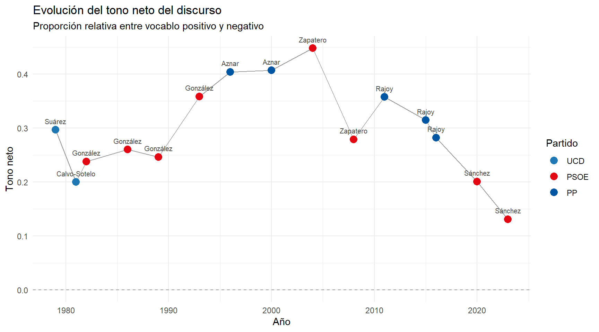

El tono neto asciende desde 1979 hasta un máximo en **2004 (Zapatero, 0,45)**, y desciende de forma casi monótona hasta el **mínimo histórico de 2023 (Sánchez, 0,13)**. El descenso atraviesa el cambio de partido en el Gobierno: Rajoy también desciende dentro de su propia trayectoria (0,36 → 0,31 → 0,28 entre 2011 y 2016), lo que descarta que sea un efecto puramente partidista.

#### 3.7.2 Perfil emocional (NRC)

> **En palabras sencillas**: además de "positivo/negativo", este léxico clasifica las palabras en 8 emociones básicas (alegría, confianza, miedo, ira...). Un gráfico de barras apiladas es cómodo para ver la tendencia general, pero comparar a ojo la altura de un segmento intermedio entre dos discursos es poco fiable — así que aquí, además del gráfico, damos los números exactos.

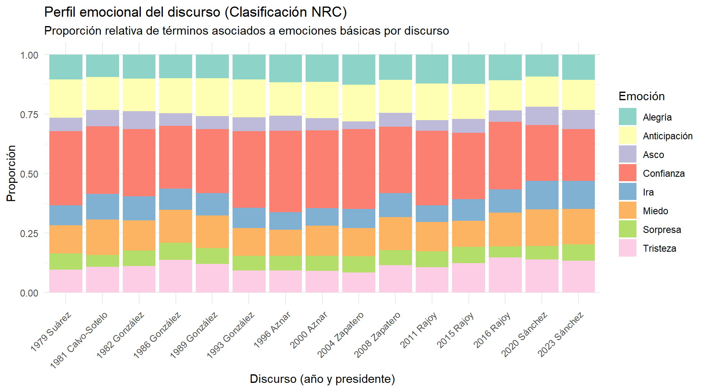

| Discurso | Ira | Anticipación | Asco | Miedo | Alegría | Tristeza | Sorpresa | Confianza |
|---|---|---|---|---|---|---|---|---|
| 1979 Suárez | 0,082 | 0,159 | 0,057 | 0,118 | 0,106 | 0,095 | 0,070 | 0,312 |
| 1981 Calvo-Sotelo | **0,108** | 0,138 | 0,069 | **0,148** | 0,095 | 0,108 | 0,049 | 0,284 |
| 1982 González | 0,102 | 0,136 | 0,076 | 0,127 | 0,102 | 0,112 | 0,064 | 0,282 |
| 1986 González | 0,089 | 0,148 | 0,052 | 0,139 | 0,100 | 0,137 | 0,072 | 0,263 |
| 1989 González | 0,093 | 0,158 | 0,055 | 0,138 | 0,101 | 0,121 | 0,065 | 0,269 |
| 1993 González | 0,086 | 0,159 | 0,058 | 0,116 | 0,106 | 0,093 | 0,060 | 0,322 |
| 1996 Aznar | 0,074 | 0,141 | 0,063 | 0,110 | 0,117 | 0,092 | 0,061 | 0,342 |
| 2000 Aznar | 0,072 | 0,151 | 0,053 | 0,127 | 0,115 | 0,091 | 0,062 | 0,327 |
| 2004 Zapatero | 0,081 | 0,155 | 0,032 | 0,118 | 0,127 | 0,083 | 0,069 | 0,335 |
| 2008 Zapatero | 0,101 | 0,139 | 0,059 | 0,139 | 0,106 | 0,115 | 0,063 | 0,278 |
| 2011 Rajoy | 0,071 | 0,154 | 0,044 | 0,123 | 0,123 | 0,106 | 0,067 | 0,314 |
| 2015 Rajoy | 0,091 | 0,148 | 0,057 | 0,109 | 0,124 | 0,124 | 0,068 | 0,279 |
| 2016 Rajoy | 0,097 | 0,126 | 0,047 | 0,141 | 0,109 | 0,147 | 0,047 | 0,285 |
| 2020 Sánchez | **0,120** | 0,127 | 0,077 | **0,153** | 0,092 | 0,139 | 0,057 | **0,235** |
| 2023 Sánchez | **0,118** | 0,127 | 0,080 | **0,149** | 0,107 | 0,134 | 0,067 | **0,217** |

*(Tabla completa con las 8 emociones NRC — la misma que se puede consultar de forma interactiva en el HTML del análisis. Resaltadas en negrita las que se comentan en el texto.)*

Con los números exactos delante, el patrón es más matizado de lo que sugiere una primera mirada al gráfico apilado. **Ira** y **miedo** sí alcanzan sus dos valores más altos de todo el corpus en 2020 y 2023 — pero **no muy por encima de un precedente**: 1981 (Calvo-Sotelo) ya mostraba niveles de ira (0,108) y miedo (0,148) bastante cercanos a los de 2020/2023, un dato que cobra sentido histórico si se recuerda que aquel discurso se debatía en el Congreso cuando Tejero irrumpió el 23-F de 1981 (ver también el apartado 3.3.1, donde ese mismo discurso destacaba en el intento descartado de medir lenguaje adversarial). No es, por tanto, un ascenso desde un terreno completamente llano — es más bien que el nivel de tensión de 2020/2023 iguala o supera ligeramente el pico más tenso de toda la Transición.

Donde el declive **sí** es inequívoco y sin precedente cercano es en **confianza**: 2020 (0,235) y 2023 (0,217) son los dos valores más bajos de toda la serie, claramente por debajo del mínimo anterior (1986, 0,263). Si hay un cambio real y sin ambigüedad en el perfil emocional reciente, es este: no tanto "más ira" (que ya se había visto, aunque brevemente, en 1981) sino "menos confianza" (que no tiene precedente comparable en 44 años).

#### 3.7.3 Contraste con un léxico nativo (ML-Senticon)

> **En palabras sencillas**: para comprobar si el patrón de tono que encontramos con el léxico traducido (NRC) es real y no un efecto de una mala traducción, repetimos la medición con un segundo diccionario, construido directamente en español por lingüistas — y comparamos si ambos cuentan la misma historia.

| Año | Presidente | Tono (NRC) | Tono (ML-Senticon) |
|---|---|---|---|
| 1979 | Suárez | 0,30 | 0,18 |
| 1981 | Calvo-Sotelo | 0,20 | 0,13 |
| 1982 | González | 0,24 | 0,17 |
| 1986 | González | 0,26 | 0,16 |
| 1989 | González | 0,25 | 0,15 |
| 1993 | González | 0,36 | 0,20 |
| 1996 | Aznar | 0,40 | 0,22 |
| 2000 | Aznar | 0,41 | 0,22 |
| 2004 | Zapatero | 0,45 | 0,18 |
| 2008 | Zapatero | 0,28 | 0,18 |
| 2011 | Rajoy | 0,36 | 0,18 |
| 2015 | Rajoy | 0,31 | 0,21 |
| 2016 | Rajoy | 0,28 | 0,23 |
| 2020 | Sánchez | 0,20 | 0,13 |
| 2023 | Sánchez | 0,13 | 0,11 |

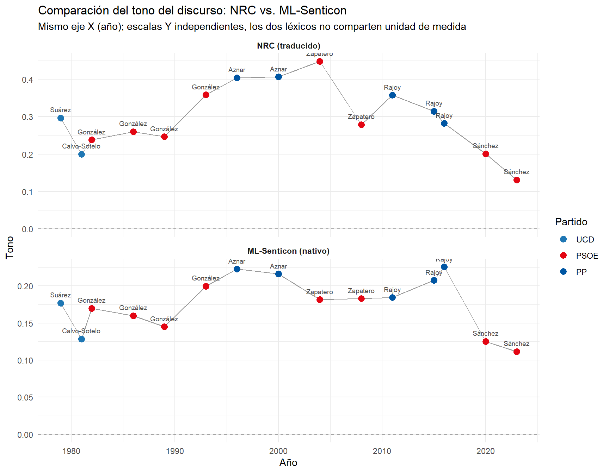

Los dos paneles del gráfico están en escalas distintas a propósito (los dos léxicos no miden la polaridad con la misma unidad), pero la **forma** de ambas curvas es visiblemente parecida: caída en 1981, ascenso hasta un pico a mitad de los 2000/2016, y descenso pronunciado en los últimos discursos de cada serie.

**Este parecido no es solo una impresión visual.** Calculamos la correlación de Spearman entre las dos series:

> **rho = 0,78 — p-valor = 0,001**

> **En palabras sencillas**: 0,78 es una correlación fuerte (el máximo posible es 1), y el p-valor de 0,001 significa que es muy poco probable que esta coincidencia se deba al azar. Este es, con diferencia, el resultado que más confianza aporta a todo el informe: **dos métodos de sentimiento completamente independientes, uno traducido y otro nativo, coinciden de forma estadísticamente significativa** en cómo ordenan la positividad de los 15 discursos. El declive de tono desde 2011 no depende de qué diccionario se use.

---

## 4. Discusión general: cruzando los hallazgos entre secciones

> **En palabras sencillas**: esta sección junta las piezas de los apartados anteriores para ver si cuentan la misma historia. Cuando varios métodos distintos, que no dependen unos de otros, señalan lo mismo, es mucho más probable que el hallazgo sea real y no una casualidad de un método concreto.

No hay un único punto de inflexión limpio — al mirar las distintas líneas de evidencia juntas, aparecen **dos patrones temporales distintos que conviene no confundir**: un declive gradual del tono general, que arranca ya en 2004-2008 y se acentúa desde 2011, y un colapso más agudo y sin precedente comparable, concentrado específicamente en la confianza, desde 2020 (apartado 3.7.2). Cuatro líneas de evidencia, obtenidas con métodos independientes, respaldan este patrón general de deterioro:

1. El **dendrograma de similitud textual** separa 2015-2023 del resto de la serie en el nivel más alto de la jerarquía — coherente con el tramo más reciente del declive.
2. El **tono NRC** inicia su declive sostenido desde 2004-2008, acentuado desde 2011.
3. El **perfil emocional NRC** muestra que, aunque ira y miedo ya habían tocado niveles similares en 1981, la caída de **confianza** en 2020/2023 no tiene precedente comparable en toda la serie (apartado 3.7.2) — el componente más tardío y más agudo de este patrón.
4. El **tono ML-Senticon**, construido de forma completamente independiente, confirma la misma tendencia general con una correlación fuerte y significativa (ρ = 0,78; p = 0,001) frente al NRC.

**Una advertencia necesaria sobre partido vs. época**: el tono medio por partido da PP (0,35) por delante de PSOE (0,27) — una diferencia que podría malinterpretarse como "el PP tiene un discurso más positivo". La lectura correcta es otra: los cinco discursos del PP se concentran entre 1996 y 2016, mientras que los ocho del PSOE cubren 1982-2023, **incluyendo los dos discursos más negativos de toda la serie** (2020 y 2023). La media del PSOE está sesgada a la baja por incluir la etapa más reciente y más negativa, etapa en la que el PP no tiene discursos con los que comparar. Es un caso de manual de cómo una asimetría en el diseño del corpus puede simular un efecto de partido que en realidad es un efecto de época.

---

## 5. Limitaciones del estudio

- **n=15 discursos** es la limitación más importante y transversal — adecuado para estadística descriptiva pero insuficiente para que el STM (K=5) sea plenamente robusto, y limita también la potencia de cualquier prueba de significancia estadística en general.
- El **léxico NRC** es una traducción automática; mitigado parcialmente por la confirmación cruzada con ML-Senticon (apartado 3.7.3), pero ambos siguen siendo aproximaciones, no medidas de referencia certificadas.
- El **filtrado de verbos** excluye el tono de la acción política (justificación completa en el apartado 2.2).
- El **residuo de lematización** ("señorías", "señora"/"presidenta", "vista"/"punto") ya está corregido y verificado (apartado 2.3).
- La **confusión entre partido y época** es en gran medida estructural al diseño del corpus y no se puede resolver sin ampliar el corpus — algo que la propia historia política española no permite, porque estos son *todos* los discursos de investidura existentes.
- Los índices de legibilidad y riqueza léxica son aproximaciones, no medidas exactas.

---

## 6. Conclusiones

> **En palabras sencillas**: aquí resumimos, sin tecnicismos, lo más importante que hemos aprendido de los 15 discursos — y por qué creemos que cada cosa es cierta, no solo que "parece" cierta.

**1. El discurso político español se ha simplificado de forma sostenida y medible durante 44 años.**
No es una impresión: el índice de legibilidad sube casi sin interrupción desde 1979 hasta 2023, y ese ascenso va de la mano de frases cada vez más cortas. Sánchez representa el caso más extremo de esta tendencia — sus discursos son los más largos en número de palabras de todo el corpus, pero también los que tienen más frases, lo que da como resultado una combinación poco intuitiva: "decir mucho, pero en trozos pequeños y fáciles de seguir".

**2. El tono del discurso ha pasado de una tendencia ascendente hasta 2004 a un declive sostenido hasta el mínimo histórico de 2023 — y esto es, con diferencia, el hallazgo metodológicamente más sólido de todo el informe.**
No se apoya en un solo diccionario de sentimiento, sino en **dos léxicos construidos de forma completamente independiente**, que **coinciden entre sí con una correlación fuerte y estadísticamente significativa** (ρ = 0,78; p = 0,001). Con los valores exactos de emociones delante (apartado 3.7.2), el matiz más preciso es que la **confianza** cae a mínimos sin precedente en 2020/2023, mientras que la **ira** y el **miedo**, aunque también alcanzan sus valores más altos ahí, ya habían tocado niveles cercanos en 1981 — así que el declive de tono es real y sólido, pero no uniforme entre las distintas emociones que lo componen.

**3. Desde 2015, el discurso de investidura español ocupa un espacio léxico distinto al de las tres décadas anteriores.**
El análisis de similitud agrupa los discursos de 2015-2023 en un bloque que se separa de todo lo anterior en el nivel más alto de la jerarquía — por encima, incluso, de las diferencias entre partidos. La lectura más plausible es la fragmentación del sistema de partidos español desde 2015 (fin del bipartidismo, necesidad de negociar apoyos, gobiernos en minoría o coalición), que obliga a un vocabulario de la negociación multipartidista ausente cuando bastaba con la mayoría de un solo partido — confirmado de forma independiente en el KWIC, donde "gobernabilidad y pactos" se intensifica justamente en los discursos de gobiernos en minoría.

**4. Sánchez es el único presidente cuyo vocabulario más distintivo nombra directamente a un adversario político concreto — y de hecho nombra a dos, presentados como aliados entre sí.**
El *keyness* de 2023 no solo incluye "vox" — incluye también "popular" y "partido", que corresponden casi en su totalidad a menciones explícitas del Partido Popular, constantemente emparejado con Vox en el propio discurso ("el Partido Popular y Vox"). Ningún otro presidente del corpus tiene entre sus palabras más características el nombre de un partido rival.

*Este punto se refiere al discurso de 2023 y a una medición (*keyness*) que detecta distintividad léxica con precisión — no confundir con el experimento del apartado 3.3.1 (retomado en el punto 10), sobre un discurso y un método distintos, que se descartó precisamente por no ser fiable.*

**5. Al mirar de cerca qué *tipo* de vocabulario distingue a cada etapa, aparecen al menos cuatro maneras distintas de ocupar el discurso — una tipología más rica que la simple dicotomía "izquierda social / derecha económica".**
El PP (Aznar, Rajoy) tiene un vocabulario claramente de política económica nacional (privatización, empleo, deuda); Zapatero tiene un vocabulario social-programático (inmigración, mujer, decente); González no encaja en "económico" en el mismo sentido que el PP — su vocabulario distintivo (comunitario, acta) es institucional y de integración europea; y Sánchez, como se ve en el punto 4, no encaja en "social" al estilo Zapatero, sino en confrontación ideológica directa. La vista por discurso individual del *keyness* (apartado 3.2) además matiza esta tipología dentro de cada presidente — el propio González pasa de vocabulario "europeo-institucional" en 1986 a vocabulario de "gestión de crisis" en 1993, por ejemplo — así que estas cuatro categorías son una simplificación útil a nivel de presidente, pero no describen a ningún presidente por completo en todos sus discursos.

**6. Comparar discursos del mismo presidente en momentos distintos — no solo entre presidentes — revela matices reales, incluidos resultados negativos que también son informativos.**
Aznar pasa de un vocabulario de convergencia fiscal para el euro (1996, gobierno en minoría con apoyo de PNV y CiU) a uno de liberalización y reforma unilateral (2000, ya con mayoría absoluta) — un giro real de sustancia política, visible solo al mirar cada discurso por separado en vez de agregar por presidente. Pero al comprobar si el Aznar de 2000 suena además "más agresivo" que el de 1996, los números lo descartan con precisión: tono neto casi idéntico (0,40 y 0,41) y proporción de ira prácticamente igual (0,074 y 0,072, apartado 3.7.2). Es un resultado negativo, pero informativo: sugiere que ese tipo de asertividad, si existe, vive más en los verbos que este proyecto excluye deliberadamente (apartado 2.2) que en el vocabulario nominal que sí mide.

**7. El modelado de temas produce una fiabilidad desigual: no todos sus resultados merecen la misma confianza.**
Al comparar el modelo principal (5 temas, con variables de partido y año) contra una versión más simple (3 temas, sin esas variables), tres de los cinco temas originales sobreviven casi intactos — los que corresponden a la crisis económica de Rajoy, la integración europea de González, y la polarización de Sánchez 2023. Los otros dos (la etapa de Zapatero y la Transición) se diluyen o se mezclan con otros al simplificar el modelo, lo que sugiere que son más sensibles a las particularidades de pocos documentos que a un patrón temático genuinamente estable.

**8. Cualquier comparación agregada "por partido" en este corpus debe leerse con desconfianza activa, no con un simple aviso de cortesía.**
El tono medio del PP (0,35) es más alto que el del PSOE (0,27) — una cifra que invita a leerse como "el PP tiene un discurso más positivo". Pero el diseño del corpus hace esa lectura engañosa: los cinco discursos del PP se concentran entre 1996 y 2016, mientras que los ocho del PSOE cubren 1982-2023, incluyendo los dos discursos más negativos de toda la serie, en una etapa donde el PP no tiene ningún discurso con el que comparar. Es la ilustración perfecta de por qué "diferencia entre grupos" y "diferencia entre partidos" no son lo mismo cuando los grupos no están repartidos de forma comparable en el tiempo.

**9. Los seis ejes temáticos del KWIC confirman, con lupa, que la agenda del discurso sigue de cerca la actualidad histórica real — no es un artefacto del método.**
Terrorismo en declive claro tras la disolución de ETA (2018); integración europea como el único de los seis ejes presente sin excepción en los 15 discursos; crisis económica repuntando exactamente en 1993 y 2011-2015; territorialidad y Cataluña en ascenso pronunciado desde 2010; igualdad en ascenso sostenido; y gobernabilidad/pactos más presente en gobiernos de coalición o minoría. Que la presencia de cada término coincida tan bien con el momento histórico en que "debería" aparecer es, en sí mismo, una validación indirecta de que el método está midiendo algo real y no ruido.

**10. Un intento fallido documentado con rigor vale tanto como un hallazgo — y aquí tenemos uno: los diccionarios de palabras sueltas no distinguen negaciones.**
El intento de medir "lenguaje adversarial" con un diccionario de palabras (apartado 3.3.1) produjo un resultado invertido respecto a lo que sugería una lectura cuidadosa del texto real: el discurso de Sánchez de 2020, el que más "adversarial" salía en el recuento bruto, resultó estar **rechazando** la hostilidad ("no tenemos enemigos"), no ejerciéndola. Es una demostración concreta, con evidencia textual propia (y verificable directamente en el código, no solo citada en prosa), de una limitación bien conocida en lingüística computacional. Es, en definitiva, un hallazgo sobre el propio método, no sobre los presidentes que estudia — y es la razón por la que la confrontación directa de Sánchez que sí se sostiene (punto 4) se documenta con *keyness*, la herramienta que le hace justicia, y no con este diccionario descartado.

---

## 7. Líneas futuras de trabajo

- Incorporar un análisis específico sobre los verbos excluidos en la lematización, centrado en el tono de la acción política (colaborativo vs. impositivo) — con detección del alcance de la negación en la estructura sintáctica (UDPipe ya registra las relaciones de dependencia necesarias), para evitar el problema documentado en el apartado 3.3.1.
- Sustituir o complementar aún más el análisis de sentimiento con recursos adicionales validados en español.
- Revisar cualitativamente el discurso de González 1986 para entender el origen del valor anómalo de MATTR.
- Si en el futuro se dispone de discursos de investidura autonómicos o de otros países, ampliar el corpus permitiría separar de forma más limpia el efecto de partido del efecto de época, y daría al STM el volumen de datos que necesita para resultados plenamente fiables.

---

## Créditos

El análisis de sentimiento con léxico nativo en español (apartado 3.7.3) usa **ML-Senticon**:

> Cruz, F. L., Troyano, J. A., Pontes, B., & Ortega, F. J. (2014). *ML-SentiCon: Un lexicón multilingüe de polaridades semánticas a nivel de lemas*. Procesamiento del Lenguaje Natural, 53, 113-120.

## Sobre el proceso

Este proyecto se ha desarrollado con la colaboración de Claude (Anthropic) como asistente técnico, para la generación y depuración de código, y como interlocutor en el proceso metodológico. Las decisiones de diseño, la interpretación de los resultados y la verificación final del análisis son mías.

## Anexo: tabla de datos completa

| Discurso | Partido | Palabras | Fernández-Huerta | MATTR | Tono (NRC) | Tono (ML-Senticon) |
|---|---|---|---|---|---|---|
| 1979 Suárez | UCD | 12111 | 38.65 | 0.84 | 0.30 | 0.18 |
| 1981 Calvo-Sotelo | UCD | 8442 | 48.15 | 0.81 | 0.20 | 0.13 |
| 1982 González | PSOE | 9398 | 41.67 | 0.85 | 0.24 | 0.17 |
| 1986 González | PSOE | 11335 | 39.22 | 0.72 | 0.26 | 0.16 |
| 1989 González | PSOE | 7588 | 42.40 | 0.79 | 0.25 | 0.15 |
| 1993 González | PSOE | 8117 | 39.08 | 0.81 | 0.36 | 0.20 |
| 1996 Aznar | PP | 10162 | 43.67 | 0.83 | 0.40 | 0.22 |
| 2000 Aznar | PP | 8321 | 51.19 | 0.81 | 0.41 | 0.22 |
| 2004 Zapatero | PSOE | 7868 | 46.62 | 0.82 | 0.45 | 0.18 |
| 2008 Zapatero | PSOE | 9477 | 48.39 | 0.81 | 0.28 | 0.18 |
| 2011 Rajoy | PP | 9678 | 53.88 | 0.81 | 0.36 | 0.18 |
| 2015 Rajoy | PP | 9974 | 50.41 | 0.82 | 0.31 | 0.21 |
| 2016 Rajoy | PP | 5862 | 54.86 | 0.84 | 0.28 | 0.23 |
| 2020 Sánchez | PSOE | 15243 | 52.54 | 0.81 | 0.20 | 0.13 |
| 2023 Sánchez | PSOE | 14062 | 55.68 | 0.82 | 0.13 | 0.11 |
